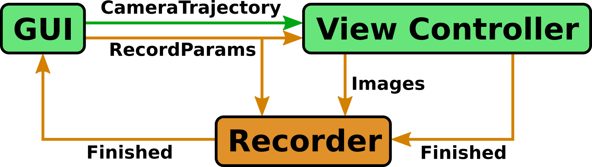

# Package Structure

### Version 1.0

Version 1.0 of the Rviz Cinematographer consisted of the **GUI** and the **View Controller**.  
In the GUI the user creates trajectories for the rviz camera.  
*CameraTrajectory* messages are send to the *View Controller* moving the camera to the desired poses.    

### Version 2.0

In Version 2.0 the **Recorder** was added to generate a video of what the user is seeing as a movement is requested and performed.    
For that, the user specifies a set of recording parameters (file name of output video, fps, compression, watermark flag).  
These are send right before the *CameraTrajectory* message to both the *View Controller* and the *Recorder* when a new movement is triggered.  

The *Recorder* prepares a video file using the desired file path and codec (compression).  
The *View Controller* switches into the recording mode, rendering and publishing the desired movement frame by frame at the requested frame rate.   
The *Recorder* subscribes to and buffers the rendered images created by the *View Controller*.  
It adds a watermark and feeds them into the video file.   

As soon as the camera arives at the end of the trajectory (or the movement is canceled) the *View Controller* published a message to the *Recorder* indicating that rendering is finished and switches back to the regular mode.  
The *Recorder* processes the remaining buffered images, releases the video file and notifies the *GUI* that recording is finished.  