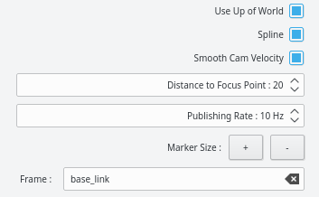

# General

Small collection of rqt plugins to create and edit rviz camera trajectory in combination with the adapted [rviz_animated_view_controller](/rviz_animated_view_controller) package.

# Plugins

### pose_interpolator:

Lightweight tool to **interpolate the camera between two poses**.


Poses can be set by:  
- manipulating two interactive markers with your mouse 
- setting each marker individually to the users current view point 

Hover with your mouse over a button in the tool to get more informations.

This plugin basicly offers a subset of the functionality of the trajectory_editor.

---

### trajectory_editor:

A more sophisticated tool to **create longer camera trajectories**.


This plugin offers a whole variaty of options to edit and create camera trajectories using several interactive markers and options to control the camera speed, roll angle, trajectory smoothness and more.  
Detailed instructions provided below in the *Tutorial*. 

Hover with your mouse over a button in the tool to get more informations.   

# Install

Clone or download this repository into your ros catkin workspace.  
Make/Build this package - induces build of rviz_animated_view_controller package. 

# Getting Started

I recommend to launch the provided launch file to get a feeling for this tool without any distractions.  
The tutorial below introduces most features. 

Alternatively you can start the provided plugins inside rqt at any time to create camera trajectories within already running rviz visualizations.  
Some [remarks](/rqt_pose_interpolator/README.md#remarks) for this use case are added after the tutorial section. 

# Tutorial

The pose_interpolator provides as subset of the trajectory_editor's functionality.  
We will first explain the functions of the former and continue with the additions in the ladder.  

### pose_interpolator


##### Start and End Point:

The green start point and the red end point are visualized by interactive markers.  
You can move the rviz camera from its current position to one of these markers using the corresponding *Move here* button.   

To manipulate the interactive markers you can either use the visualized circles or the *Set to Cam Pose* button.  
The button sets the corresponding point to the user's current view.  

Remark:  
Rviz doesn't allow to alter the view using the mouse buttons or wheel when hovering over an interactive marker.  
To not get stuck, it's helpful to hold the right-click and move the mouse to zoom out.

##### Parameters:

| Parameter | Functionality |
| -------- | -------- |
| Transition Time  | Defines the time it takes for the camera to move to the target point |
| Us Up of World   | If disabled, the camera is not allowed to perform roll motions |
| Distance to Focus Point | The distance between the eye point and the focus point of the camera |
| Frame |  The frame_id of the interactive markers |

---

### trajectory_editor:


##### Camera Movements:

This plugin provides two or more markers to specify a trajectory for the rviz camera.  
The green marker indicates the currently active marker.  
Left-click on a marker to select the clicked as the active marker.  

| Button | Functionality |
| -------- | -------- |
| ⏮ | Move the camera within the trajectory to the first marker |
| ∣◄ | Move the camera to the previous marker within the trajectory |
| Move to Current Pose | Move the camera to the currently active marker |
| ►∣ | Move the camera to the next marker within the trajectory |
| ⏭ | Move the camera within the trajectory to the last marker |

The pose of and the transition time to the active marker can be tuned using the spin boxes in the *Edit Pose* tab. 

---

##### Adding and Removing Markers:

To edit the number of markers defining the trajectory use right-click menu.  


Additionally you can append a marker at the end of the trajectory at the current position of the camera using the *Append at Cam Pose* button.

---

##### Parameters:



| Parameter | Functionality |
| -------- | -------- |
| Spline | If enabled, interpolates poses using a spline |
| Smooth Cam Velocity | Combine with spline to use total transition time to create smooth velocity for whole trajectory - use ⏮ and ⏭ | 
| Publishing Rate | Smoothness of spline |
| Marker Size | In- or decrease the markers' size |

Thanks to https://github.com/ejmahler/SplineLibrary for providing an easy to use spline library.

---

##### Save/Open:

Save your trajectory using the *Save As..* button and load existing ones using the *Open* button.  
Additionally one trajectory can be specified in the launch file to be loaded on initialization.

# Remarks

You have the option to create a camera trajectory within an already running rviz instance.   
For this, just run your application and visualization in rviz as usual and additionally start rqt by 

```
$ rqt
```

Click on "Plugins -> Visualization -> Trajectory Editor".

**Caveat:** Be aware, that rviz should **not** be started as an rqt plugin, because this experimental version of rviz crashes every time a *Path* message is received.

Now you have to add the *InteractiveMarkers* and the *Path* displays.  
Make sure the frame specified in the Trajectory Editor plugin is present in your tf tree, otherwise you will not be able to see the markers. 

Additionally you have to select the rviz_animated_view_controller in the Rviz *Views* in order to be able to move the camera using the plugin.


I would recommend to use the *Fixed Frame* as the Target Frame for the view. 
