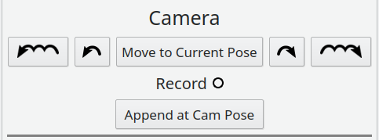
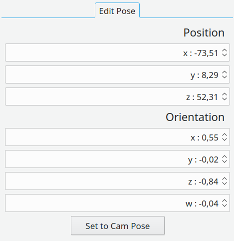
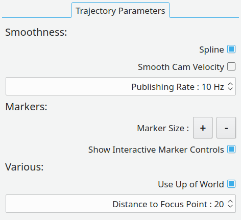
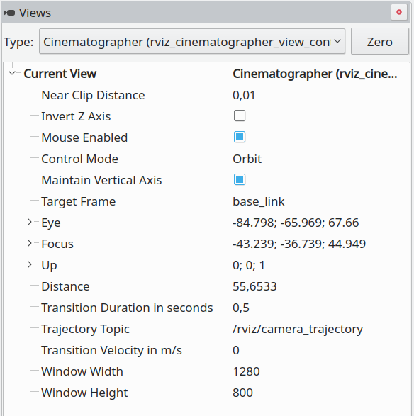

# General

An rqt plugin serving as the front-end for the *Rviz Cinematographer*.  
Create and edit trajectories to move the rviz camera along and record what is visualized in rviz directly to a video file.


# Install

Clone or download this repository into your ros catkin workspace.  
Make/Build this package - induces build of other packages. 

# Getting Started

I recommend to launch the provided launch file to get a feeling for this tool without any distractions. 

```
$ roslaunch rviz_cinematographer_gui rviz_cinematographer_gui.launch
```

The tutorial below introduces most features. 

Alternatively, you can start the provided plugin inside rqt at any time to create camera trajectories within already running rviz visualizations.  
Some [remarks](README.md#remarks) for this use case are added after the tutorial section. 

# Tutorial

This plugin offers a whole variety of options to edit and create camera trajectories using several interactive markers.  
Additionally it provides a set of options to control the camera speed, roll angle, trajectory smoothness and more.  

Hover with your mouse over a button in the plugin to get more information.   

##### Camera Control:

The five buttons always visible on top are used to control the rviz camera.  
Pressing one of them will move the camera with respect to the currently active marker colored in green.  
Left-click on a marker to select the clicked as the active marker.   

| Button | Functionality |
| -------- | -------- |
|  | Move the camera within the trajectory from the active to the first marker |
|  | Move the camera to the marker previous to the active |
| Move to Current Pose | Move the camera to the currently active marker |
|  | Move the camera to the marker after the active |
|  | Move the camera within the trajectory from the active to the last marker |

Activate the *Record* to record a video of the next camera movement initiated by the five buttons above.  
More details to recording videos are provided [below](README.md#recording-parameters). 

Press the *Append at Cam Pose* button to extend the existing trajectory.  
The button press adds another marker at the current pose of the rviz camera to the end of the trajectory.  
This way it's esy to create a trajectory quickly by moving to camera to interesting poses and appending new markers.  



**Remark:  
Rviz doesn't allow to alter the view using the mouse buttons or wheel when hovering over an interactive marker.  
To not get stuck, it's helpful to hold the right-click and move the mouse to zoom out.**

### Tabs

In the following, the functionalities organized in the tabs are explained in detail. 

##### Timing:

After creating your trajectory, you would want to specify how fast the camera is moving from one marker to the other.  
This can be done in the *Timing* tab.  
The table shows in its first column the duration it takes to move the camera from the previous marker to the next.  
The values in the second column denote the duration the camera waits after reaching the pose of a marker.  


Using the buttons below the table you can add additional markers before, at or after the currently selected marker.  
  
Another option to edit the number of markers defining the trajectory is to right-click on an interactive marker.


Use *Delete* on your keyboard to remove the active marker. 

##### Edit Pose:

This tab can be used to edit the marker poses of the trajectory.  
The easiest way to edit a marker pose is by moving the camera within rviz to the pose you like and pressing the *Set to Cam Pose*-button.  
This sets the pose of the active marker to the selected pose.   

Alternatively, the pose of and the transition time to the active marker can be tuned using the spin boxes. 

The third option is to manipulate the interactive markers directly using your mouse.  



---

##### Trajectory Parameters:

| Parameter | Functionality |
| -------- | -------- |
| Spline | If enabled, interpolates poses using a spline |
| Smooth Cam Velocity | Combine with spline to use trajectories' total transition time to move with a smooth velocity to first or last marker | 
| Publishing Rate | Smoothness of spline |
| Marker Size | In- or decrease the markers' size |
| Show Interactive Marker Controls | Display the rings around a marker to edit the marker pose |
| Use Up of World   | If disabled, the camera is not allowed to perform roll motions |
| Distance to Focus Point | The distance between the eye point and the focus point of the camera |



Thanks to https://github.com/ejmahler/SplineLibrary for providing an easy to use spline library.

---

##### Recording Parameters:

| Parameter | Functionality |
| -------- | -------- |
| Record to | Directly specify the path and name of the output video file - or use button to navigate in a file explorer |
| Frames Per Second | Specify the FPS for the output video |
| Compress Video | Toggle between codecs - divx for compressed output and FFV1 for raw videos | 
| Add Watermark | If checked, a watermark is added at the bottom right of the video |


---

##### Save/Open Trajectory:

Save your trajectory using the *Save As..*-button and load existing ones using the *Open*-button.  
Additionally one trajectory can be specified in the launch file to be loaded on initialization.

# Remarks

You have the option to create a camera trajectory within an already running rviz instance.   
For this, just run your application and visualization in rviz as usual and additionally start rqt by 

```
$ rqt
```

Click on "Plugins -> Visualization -> Rviz Cinematographer".

**Caveat:** Be aware, that rviz should **not** be started as an rqt plugin, because this experimental version of rviz crashes every time a *Path* message is received.

Now you have to add the *InteractiveMarkers* and the *Path* displays.  
Make sure the frame specified in the Rviz Cinematographer plugin is present in your tf tree, otherwise you will not be able to see the markers. 

Additionally you have to select the rviz_cinematographer_view_controller in the Rviz *Views* in order to be able to move the camera using the plugin.  
In this view useful information is displayed e.g. the window width and height defining the video size in pixels.  



I would recommend to use the *Fixed Frame* as the Target Frame for the view. 

---

All of these steps were taken care of when starting the *Rviz Cinematographer* using the provided launch file

```
$ roslaunch rviz_cinematographer_gui rviz_cinematographer_gui.launch
```

