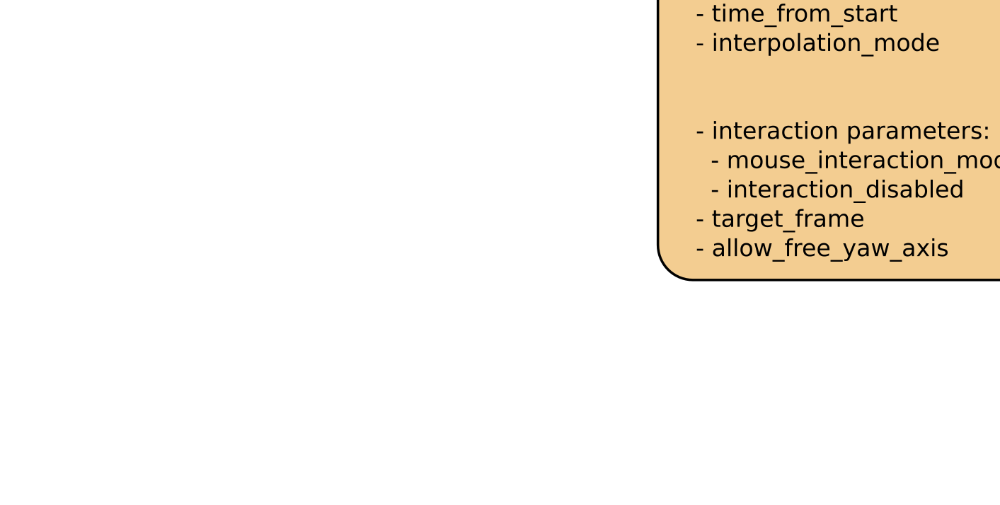

# General

Based on the [rviz_animated_view_controller](https://github.com/UTNuclearRoboticsPublic/rviz_animated_view_controller) package which is a modification of the official ros package for ros kinetic.

Added more options to **move the rviz camera along a trajectory** and an option to publish the rendered images frame by frame - used for **recording videos** with a user defined frame rate. 

# Differences

**Messages** :

Replaced *CameraPlacement* msgs by own messages.

*CameraMovement* is a subset of *CameraPlacement*.  
It consists of the target camera pose, the transition_time and the interpolation_speed.  
The last was added to provide more flexibility for the velocity of the camera.

*CameraTrajectory* consists of a vector of *CameraMovements* + interaction parameters + target_frame and yaw axis parameter.  
All of the latter were part of the *CameraPlacement* message.

**Publishing** :

Everytime the camera is moved in rviz, the camera pose is published.

Additionally Odometry msgs are published when the camera movement is triggered using the messages described above.

**Functionality** :

Using the *CameraTrajectory* msgs one can either move the camera the usual way by providing just one *CameraMovement* in the vector or move the camera along a trajectory specified by several *CameraMovements*.  

Additionally the rendered images the user sees in rviz are published if a recording is initialized and a recorder is subscribing. 

**Remark** :

If you want wo switch from the ros *rviz_animated_view_controller* to the one provided here, you just have to switch from *CameraPlacement* to the new message type *CameraTrajectory*.

It provides the same fields - except for interpolation_mode which wasn't used before and was replaced by interpolation_speed.

No previously available functionality was harmed.  
Accordingly the remaining code is untouched. 